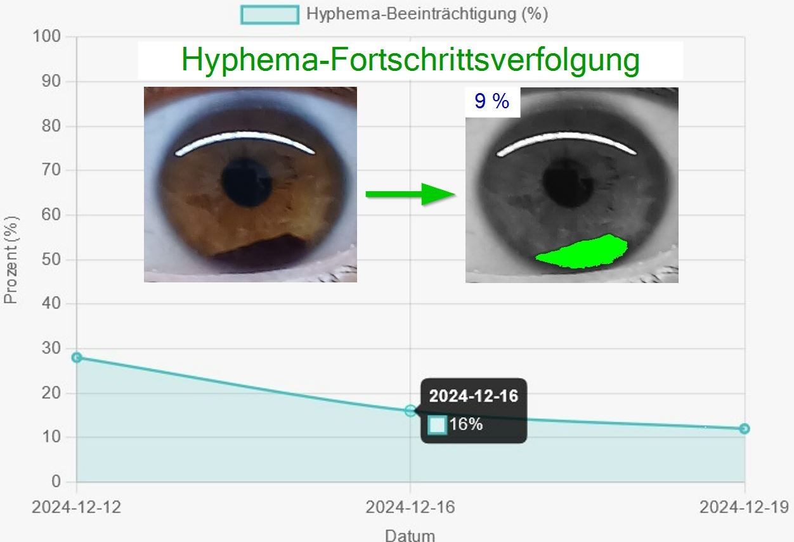

# Hyphema Healing Tracker

## About the Project
**Hyphema Healing Tracker** is a platform designed to assist patients in monitoring and managing their healing process after suffering from **Hyphema**, a condition characterized by blood accumulation in the anterior chamber of the eye. The platform is user-friendly and offers an innovative way for patients to track their healing progress over time.

### What is Hyphema?
Hyphema refers to the accumulation of blood in the anterior chamber of the eye, located between the cornea and the iris.  
- **Causes:** Typically caused by blunt or penetrating trauma, such as accidents, falls, or strikes.  
- **Risks:**  
  - Increased intraocular pressure (glaucoma).  
  - Long-term vision impairment due to residual blood or damage to the iris or cornea.  

Regular monitoring of the healing process is crucial to prevent complications and ensure proper recovery.  

This platform simplifies the monitoring process by allowing users to track their condition visually and quantitatively.

[YouTube: Hyphema-Fortschrittsverfolgung](https://youtu.be/kzff1G2RwSs?si=9UMwdwIYGjTnjkQf)

---

## Key Features
1. **User Registration & Authentication**  
   Users must register and log in to access their personal healing tracker.

2. **Adding Diagnoses**  
   - Record Hyphema diagnoses for one or both eyes.  
   - Document additional information about the diagnosis.

3. **Photo Analysis**  
   - Upload photos of your eye to monitor the percentage of blood covering the iris and pupil.  
   - Automatic analysis using a Python-based image processing system (OpenCV).  
   - Store the analyzed results with associated dates for future reference.

4. **Visual Progress Tracking**  
   - Visualize healing progress through a graph that shows the percentage of Hyphema over time.  
   - Filter results by diagnosis and affected eye.

5. **Guidelines for Accurate Photos**  
   To ensure precise analysis, users are advised to:  
   - Take photos in the morning after resting or after several hours of inactivity in a seated position.  
   - Ensure the photo is of the eye only, with the iris and pupil fully visible.  
   - Avoid photos with poor or excessively high quality to minimize analysis errors.

---

## Technologies Used

### Backend
- **Java Spring Boot**  
  - **REST API** for managing data and connecting the frontend with the backend logic.  
  - **Spring Security**: Used for user authentication and authorization.  
  - **Spring Data JPA**: To interact with the PostgreSQL database.  
  - **PostgreSQL**: For storing user data, diagnoses, and analysis results.  
  - **Docker**: To containerize the backend service.

### Image Processing
- **Python (OpenCV)**  
  - Used for analyzing uploaded photos to calculate the percentage of Hyphema coverage.  
  - The backend integrates with Python scripts via the `ProcessBuilder` in Java.
  - *Image Processing (implementation) is not available for public viewing.  

### Frontend
- **HTML/CSS, JavaScript**: For the user interface.  
- **Thymeleaf**: Used for rendering dynamic content.  

---

## Project Dependencies
Below is a list of dependencies used in the project:

- `org.springframework.boot:spring-boot-starter-thymeleaf`
- `org.springframework.boot:spring-boot-starter-validation`
- `org.springframework.boot:spring-boot-starter-data-jpa`
- `org.springframework.boot:spring-boot-starter-web`
- `com.google.code.gson:gson:2.10.1`
- `org.springframework.boot:spring-boot-starter-security`
- `org.thymeleaf.extras:thymeleaf-extras-springsecurity6`
- `com.fasterxml.jackson.core:jackson-databind:2.15.2`
- `org.springframework.session:spring-session-core`
- `org.postgresql:postgresql`
- `org.springframework.boot:spring-boot-starter-test`
- `org.junit.platform:junit-platform-launcher`

---

## How It Works
1. **Register & Log In**  
   Access your private profile by registering and logging in.

2. **Add a Diagnosis**  
   Start by adding a diagnosis for either the left or right eye. Diagnoses are stored for future reference.

3. **Upload Photos**  
   - Select a diagnosis and specify which eye (left or right) the photo belongs to.  
   - Upload the photo and trigger the analysis.  
   - The platform calculates the percentage of blood covering the iris and pupil using the Python backend.

4. **Save & Visualize Results**  
   - Save the analysis results to track progress.  
   - Use the visualization feature to display a graph of healing progress over time.

---